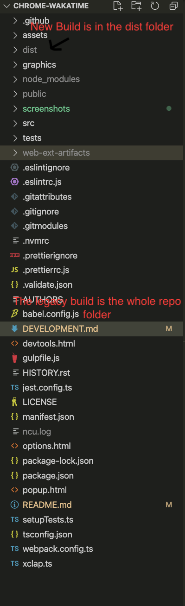
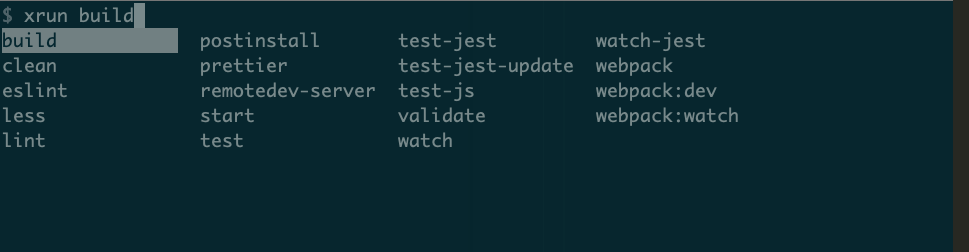

# This repository is currently migrating the build process

We are currently migrating from using [gulp](https://gulpjs.com/) -> [webpack](https://www.google.com/search?q=webpack&oq=webpack&aqs=chrome.0.69i59l3j69i60l3j69i61l2.1368j0j4&sourceid=chrome&ie=UTF-8) for asset bundling. The currently published build will be left in place until this is complete



## Pre-requisites

- node v18.13.0
- npm 8.19.3

It is suggested you use [nvm](https://github.com/nvm-sh/nvm) to manage your node version

It is suggested to install this globally[@xarc/run-cli](https://www.npmjs.com/package/@xarc/run-cli)

This will allow you to run varios tasks


## Development instructions

```
    nvm use 18
    npm install
    npm run dev
```
