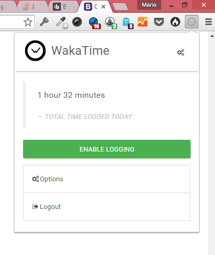
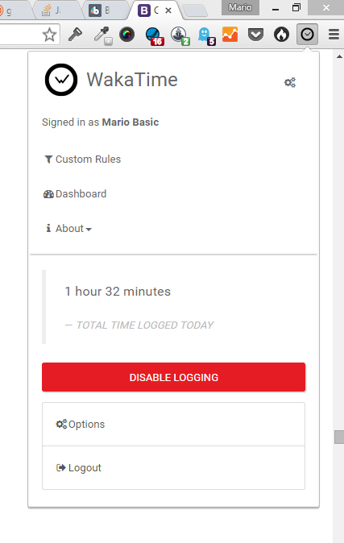
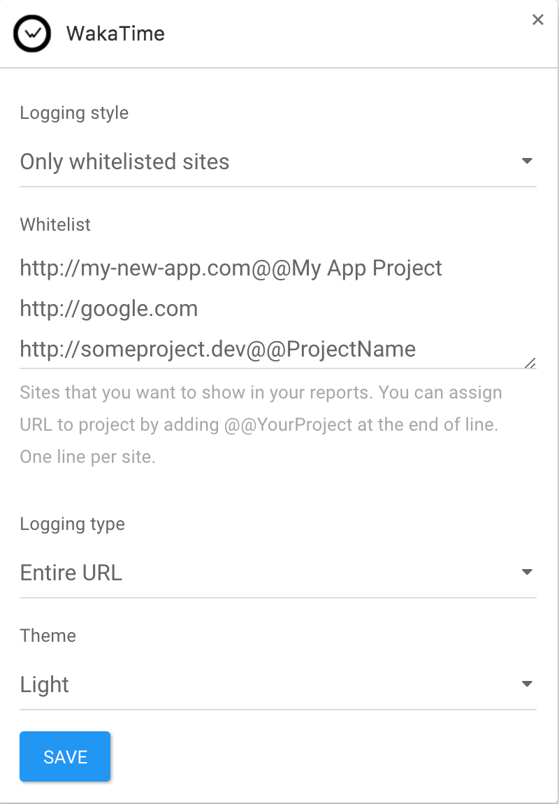
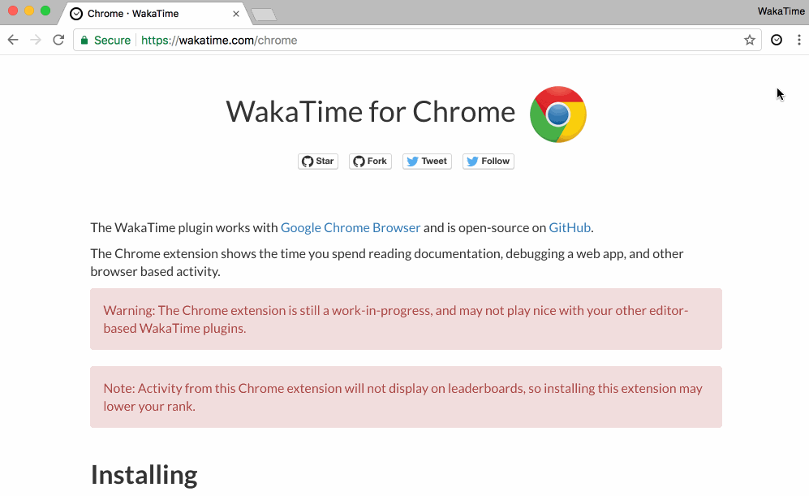

# chrome-wakatime

Automatic time tracking for stats about your website debugging, research, documentation, etc.

Note: Activity from this Chrome extension will not display on leaderboards, so installing this extension may lower your rank.

## Installation

1. Install the extension:

[](https://chrome.google.com/webstore/detail/wakatime/jnbbnacmeggbgdjgaoojpmhdlkkpblgi)

[](https://addons.mozilla.org/en-US/firefox/addon/wakatime/)

[](https://microsoftedge.microsoft.com/addons/detail/wakatime/cdnpfnaadjmaplhghnlonephmabegadl)

2. Login to [WakaTime](https://wakatime.com/).

3. Use Chrome like you normally do and your time will be tracked for you automatically.

4. Visit https://wakatime.com to see your logged time.

5. Use in conjunction with [other WakaTime plugins](https://wakatime.com/plugins).

## Screenshots







## Development instructions

> For development purposes only.

To get started, install NPM and Bower dependencies, and do an initial build with Gulp:

```
npm start
```

To build the extension once:

```
npm run gulp
```

To monitor changes:

```
npm run watch
```

Run tests:

```
npm test
```

Lint code _(Both JS and JSX)_:

```
jsxhint --jsx-only .
```

### Automatic code linting

There is a precommit hook that lints the code before commiting the changes.

### Troubleshooting

Check for errors by inspecting the extension.



The extension is going through a refactor, the new build [instructions are here](./DEVELOPMENT.md)
