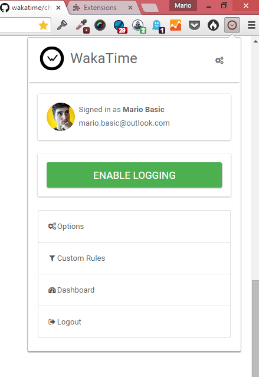
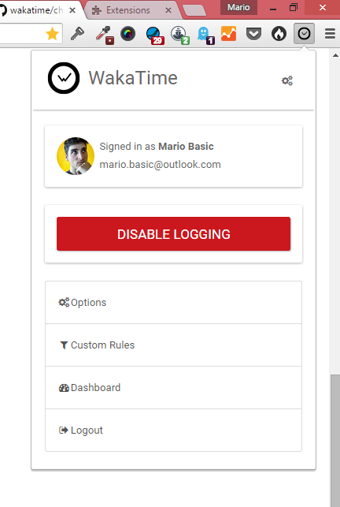
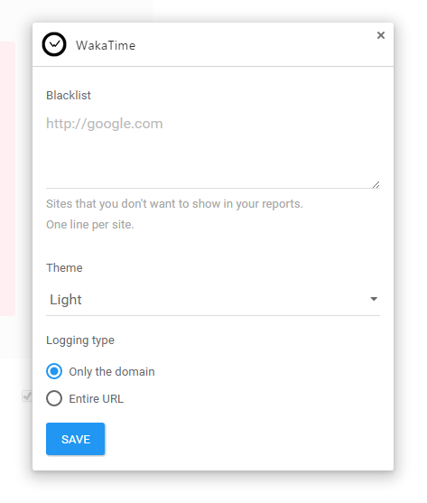

chrome-wakatime
===============

Get stats about your website debugging, research, documentation, etc.


Installation
------------

1. Install the extension inside Chrome.

2. Login to [WakaTime](https://wakatime.com/).

3. Use Chrome like you normally do and your time will be tracked for you automatically.

4. Visit https://wakatime.com to see your logged time.

5. Use in conjunction with [other WakaTime plugins](https://wakatime.com/plugins).

## Screenshots







## Development instructions

> For development purposes only.

To get started, install NPM and Bower dependencies, and do an initial build with Gulp:
```
npm start
```

Run Gulp once:

```
gulp
```

Run Gulp and monitor changes:

```
gulp watch
```

Run tests:

```
npm test
```

### Load unpacked in Chrome

1. Clone repository to disk
2. Go to `Settings` -> `Extensions`
3. Enable `Developer mode`
4. Click `Load unpacked extension...`
5. Select repository directory
