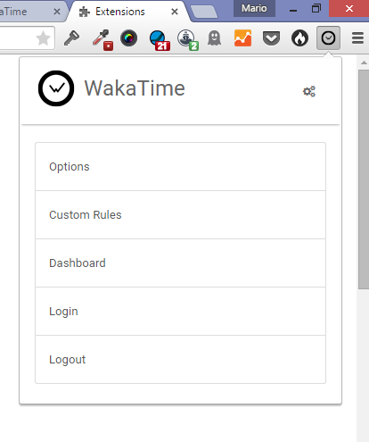
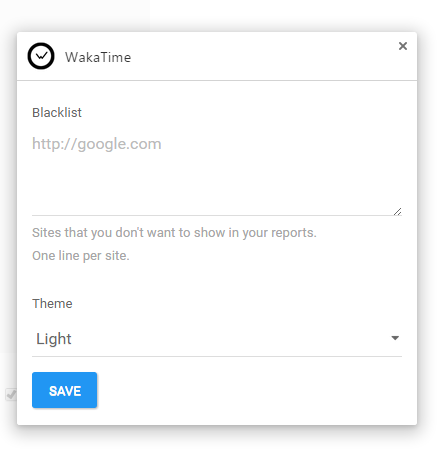

chrome-wakatime
===============

Get stats about your website debugging, research, documentation, etc.


Installation
------------

1. Install the extension inside Chrome.

2. Login to [WakaTime](https://wakatime.com/).

3. Use Chrome like you normally do and your time will be tracked for you automatically.

4. Visit https://wakatime.com to see your logged time.

5. Use in conjunction with [other WakaTime plugins](https://wakatime.com/plugins).


Screen Shots
------------


## Development instructions

> For development purposes only.

Install NPM dependencies:

```
npm install
```

Install Bower dependencies:

```
bower install
```

Run Gulp once:

```
gulp
```

Run Gulp and monitor changes:

```
gulp watch
```

### Load unpacked in Chrome

1. Go to `Settings` -> `Extensions`
2. Enable `Developer mode`
3. Click `Load unpacked extension...`
4. Select repository directory

> This is how is a example layout design for first phase.





### Issues

- Currently Elixir can only run one Browserify task at a time. (I will create a new Browserify task for this)
